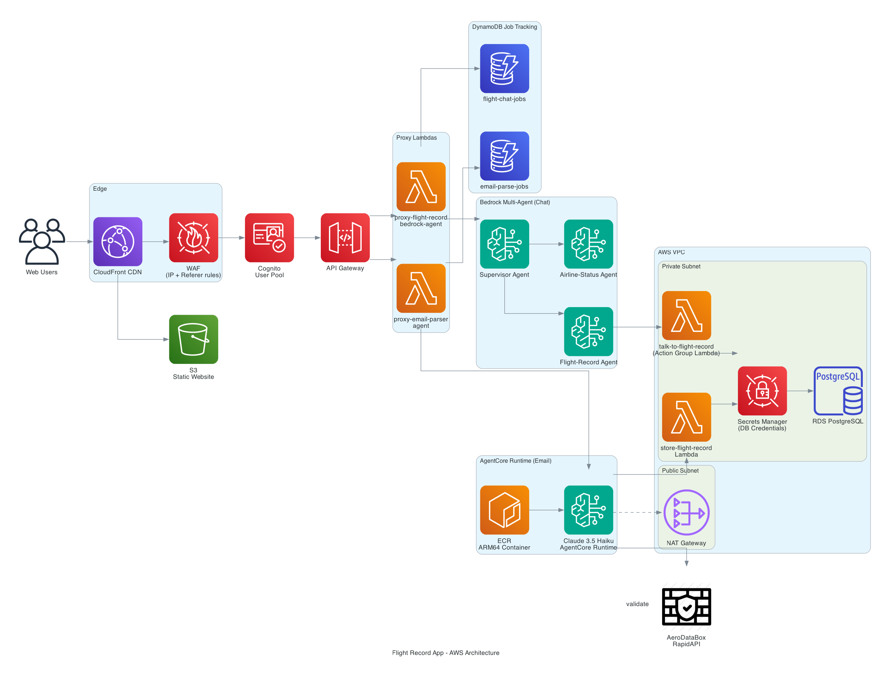
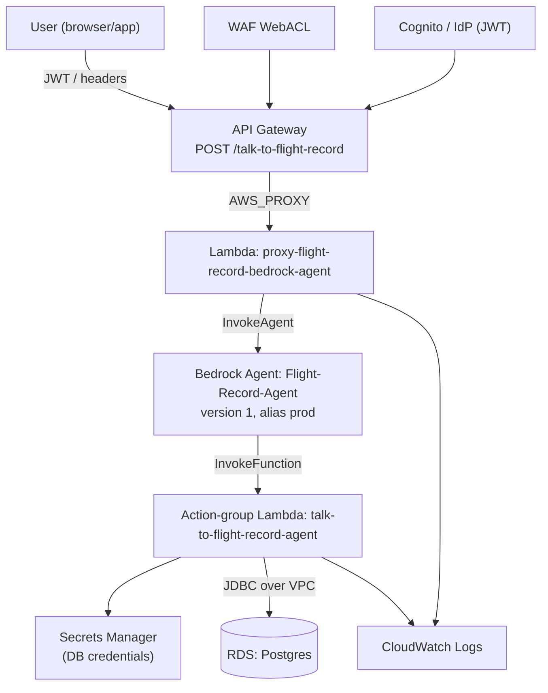
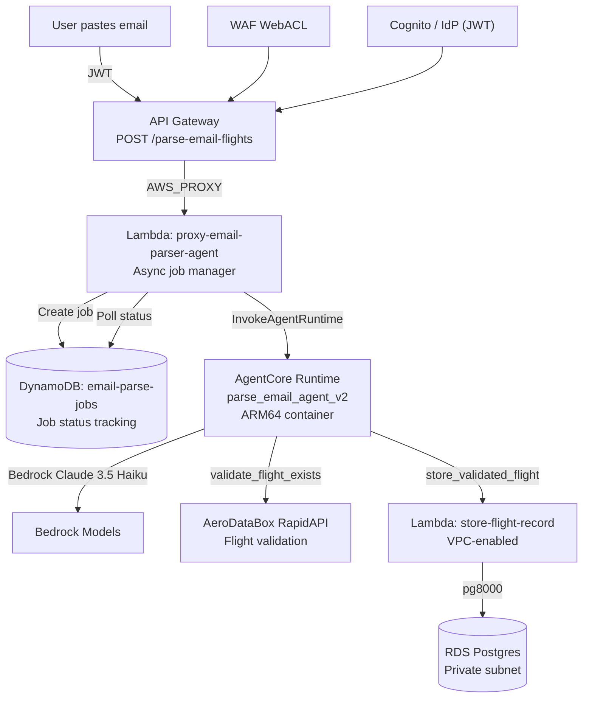

# Flight Record App

## Overview
This Flight Record Application manages flight data through two main workflows:

1. **Natural Language Query (Chat)**: Ask questions about your flights using AI-powered multi-agent collaboration (Bedrock Supervisor Agent → Flight-Record-Agent → database queries)
2. **Email Parsing**: Paste confirmation emails to automatically extract and store flight records using AWS Bedrock AgentCore Runtime with ARM64 architecture

The React (Material UI) single-page app calls AWS API Gateway + Lambda endpoints directly. All data operations happen against cloud APIs with user-scoped security via Cognito authentication.

## Project Structure
```
flight-record-app
├── README.md
├── package.json (root helper scripts for client only)
└── client
   ├── package.json
   ├── public/
   │   └── index.html
   └── src/
      ├── index.jsx
      ├── App.jsx
      ├── components/
      │   ├── FlightForm.jsx
      │   ├── FlightTable.jsx
      │   └── Layout.jsx
      ├── hooks/
      │   └── useFlights.js
      ├── config.js (API base URL export)
      ├── theme/
      │   └── index.js
      └── utils/
         └── api.js (optional abstraction)
```

## Setup (Client-only)

1. Install dependencies:
```
cd client
npm install
```
2. Create environment file(s) (do not commit secrets). For local development with the proxy:
```
client/.env.development
  REACT_APP_API_BASE_URL=/apiGateway
```
In production (served from S3/CloudFront), you can either keep the relative path with a CloudFront behavior pointing to API Gateway, or set the full URL:
```
client/.env.production
  REACT_APP_API_BASE_URL=https://<api-gateway-id>.execute-api.<region>.amazonaws.com/prod
```
3. Run locally (proxy injects allowed Referer header):
```
npm start
```
4. Build for deployment:
```
npm run build
```
Deploy `client/build` contents to an S3 bucket (optionally behind CloudFront). The legacy standalone HTML has been removed.

## AWS API Gateway Requirements
Enable CORS on the Lambda-backed endpoints:
Headers: `Content-Type,x-api-key`
Methods: `GET,POST,OPTIONS`
Origins: your domain or `*` (for development)

## Architecture Overview



### Chat System (Natural Language Queries)


### Email Parser System (AgentCore Runtime)


**Key Features:**
- **ARM64 Architecture**: AgentCore Runtime requires linux/arm64 container images
- **Async Polling**: 4-second intervals, max 5 minutes (handles 40-60s parsing time vs 29s API Gateway timeout)
- **Real-time Progress**: Frontend displays agent invocation count and elapsed time during parsing
- **Security**: RDS remains private, accessible only via VPC Lambda proxy
- **Enrichment**: Validates flights against AeroDataBox API, calculates mileage and duration
- **Graceful Degradation**: Stores email-extracted data even when API enrichment unavailable (old flights)

## Deployment Checklist
- S3 bucket static hosting (or CloudFront distribution pointing to bucket)
- Invalidations issued after each new build (CloudFront)
- API base URL set in `.env.production`
- Optional: monitoring via CloudWatch Logs for Lambda

## Removed Legacy Artifacts
- Local Express backend (removed)
- Legacy static HTML (`index ver 2.html`) removed; React SPA now the primary UI.

## Usage
- Start client: `npm start` inside `client/`.
- Enter API Key (if required by your Gateway) and flight data in the form.
- View returned records in the table.

## WAF Access Control
This API Gateway is protected by an AWS WAF WebACL with a **default block** action returning HTTP 401 and two allow rules:

1. IP allow list (rule: `access-local-machines`) – permits requests from a configured IP set (your development/workstation public IPs).
2. Referer allow list (rule: `access-s3-website`) – permits requests whose `Referer` header begins with the S3 static site URL hosting the original HTML page.

Consequences:
- Direct local development (localhost) may receive 401 unless your IP is in the allow list.
- Browsers automatically send the Referer when navigating from the S3-hosted page, so the table retrieval works there.
- Programmatic tools (curl, Postman) or alternative frontends without the allowed Referer will be blocked.

React Dev Guidance:
- If blocked (401), add your current public IP to the WAF IPSet or adjust rules.
- Referer spoofing isn’t reliable in standard browsers; prefer IP allow list or future auth enhancements.
- UI maps WAF 401 responses to a clear "Access restricted by WAF" message.

Future Hardening Options:
- Switch default block to 403 to distinguish WAF from auth failures.
- Add an Origin-header based rule if you move to CloudFront/custom domain.
- Implement Lambda authorizer or Cognito for user-level access control.

## License
This project is licensed under the MIT License.